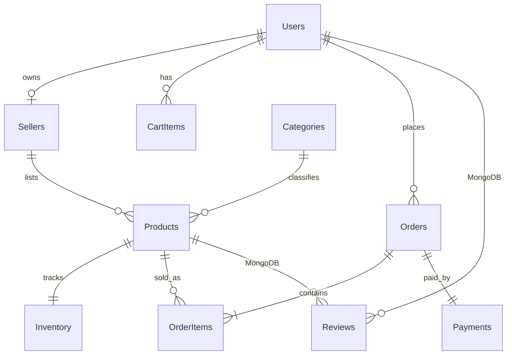

# Entity relationship diagram

```mermaid
erDiagram
  Users ||--o| Sellers : owns
  Users ||--o{ CartItems : has
  Users ||--o{ Orders : places
  Sellers ||--o{ Products : lists
  Categories ||--o{ Products : classifies
  Products ||--|| Inventory : tracks
  Orders ||--|{ OrderItems : contains
  Products ||--o{ OrderItems : sold_as
  Orders ||--|| Payments : paid_by
  Users ||--o{ Reviews : MongoDB
  Products ||--o{ Reviews : MongoDB
```

Export the diagram with Mermaid Live or a Mermaid-compatible VS Code extension.
